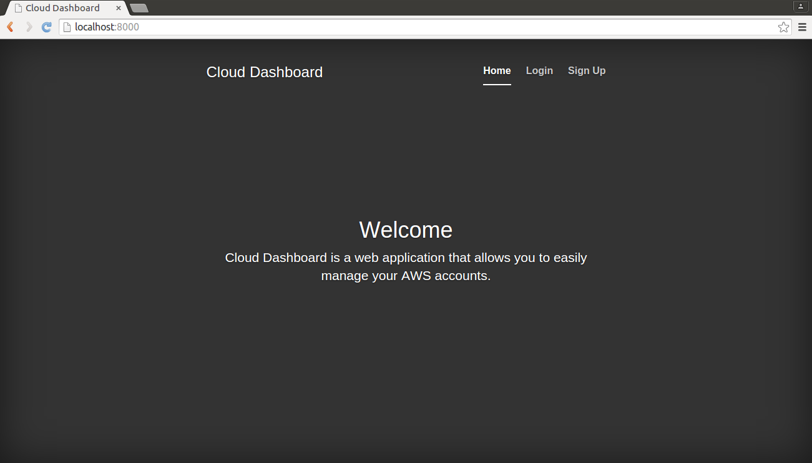
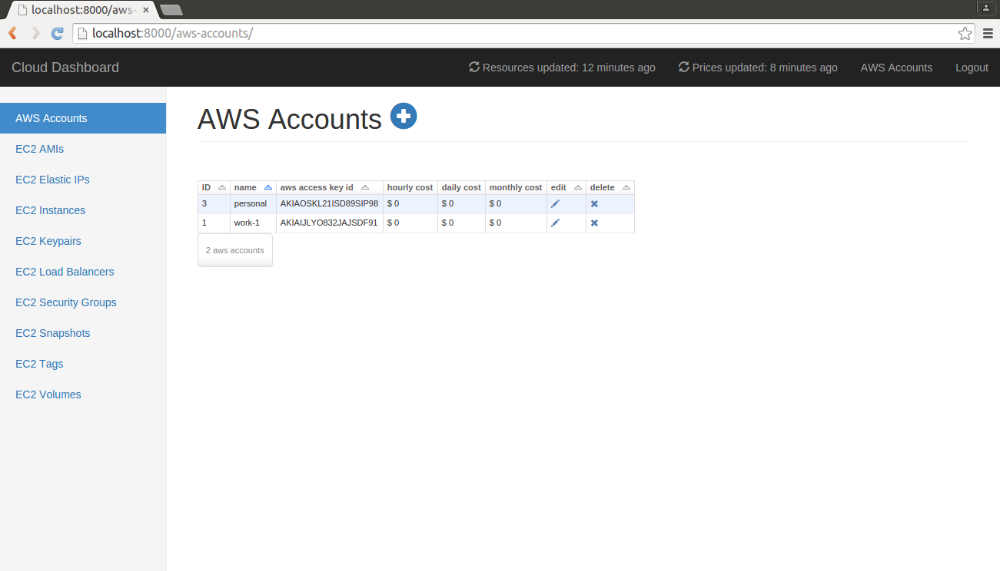
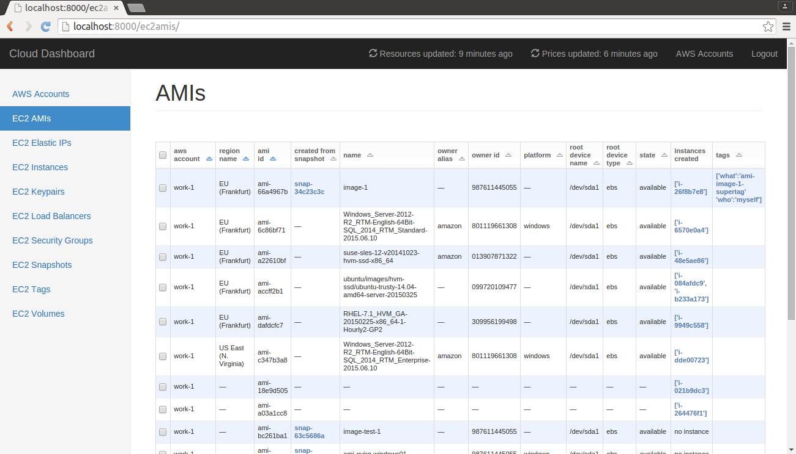
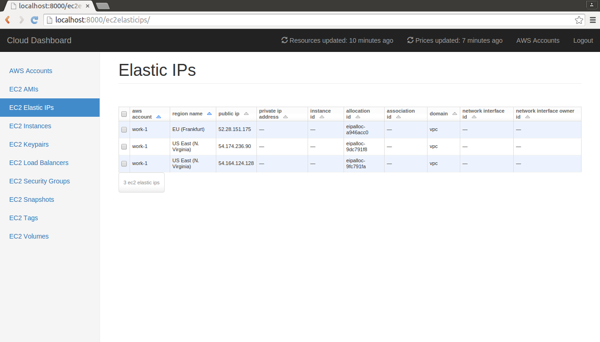
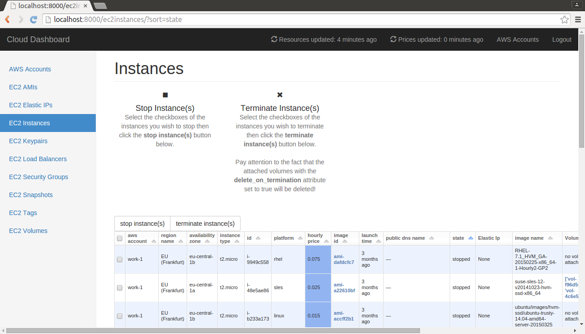
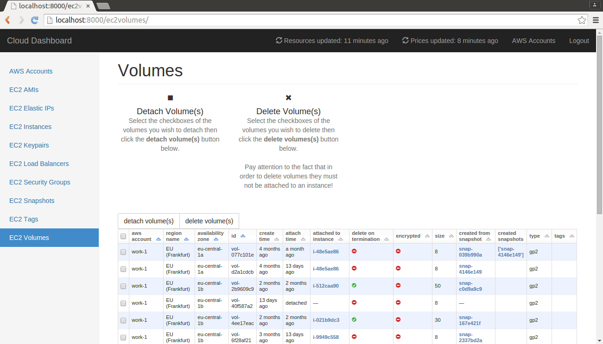

# Cloud Dashboard

## Table of contents

- [Author](#author)
- [Abstract](#abstract)
- [Details](#details)
- [Screenshots](#screenshots)
- [Build](#build)
- [Known limitations](#known-limitations)
- [Information](#information)
- [License](#license)

# Author

The author is Arnaud Desclouds <arnaud.software@use.startmail.com>, this project was developed in the context of a Bachelor thesis.

# Abstract

Cloud Dashboard is a Web application that can manage multiple AWS (Amazon Web Services) accounts simultaneously. Python 3 is used with Django as a Web framework. Cloud Dashboard offers synthetic views showing the various EC2 (Elastic Cloud Compute) resources that a user possesses: AMIs, instances, tags, volumes, etc.

Prices of instances are shown and allow a precise vision of costs. To monitor expenses it is possible to stop and terminate instances and also detach and delete volumes. Estimations of hourly, daily and monthly costs for each AWS account are available.

Browsing between resources' dependencies is extremely easy, and it allows to see the existing links and to show resources that aren't used and deserve to be deleted.

Cloud Dashboard suits perfectly an occasional or frequent AWS's user, it gives them a global view of their accounts and allows them to stay on top of their expenses.

# Details

Cloud Dashboard uses **Python 3**, **Django**, **PostgreSQL** and **RQ (Redis Queue)**.

Improves AWS mainly on four points:

1. Introduces simultaneous AWS accounts management
2. Displays instances' prices based on their operating system, region and type
3. Gives hourly/daily/monthly costs' estimates about each AWS account
4. Allows efficient resources' dependencies browsing

# Screenshots

 

# Build

## Build locally

You need to have Python 3 and virtualenv installed. 

You also need a PostgreSQL database with the name `cloud_dashboard_database`, a PostgreSQL user with all rights on that database named `cduser` with `IWL23.yvC47e` as password. All those values are modifiable in the `settings.py` file.

- Change `DEVELOPMENT = False` to `DEVELOPMENT = True` in `settings.py`.
- Create a virtualenv: `virtualenv -p python3 venv`
- Activate it: `source venv/bin/activate`
- Install packages: `pip install -r requirements.txt`
- Launch Redis Queue worker: `./app/manage.py rqworker high`
- Execute Django migrations `./app/manage.py migrate`
- Launch Django server: `./app/manage.py runserver`
- Open a browser to `http://localhost:8000`

## Deploy to Heroku

To deploy to Heroku you need an Heroku account and the Heroku toolbelt.

You need to change `DEVELOPMENT = True` to `DEVELOPMENT = False` in `settings.py`.

- Create a Git repository: `git init` and add the app to it: `git add .` and `git commit -m "Deploy"`.
- Create an Heroku app: `heroku create`
- Add a PostgreSQL database: `heroku addons:create heroku-postgresql:hobby-dev` and Redis To Go addon: `heroku addons:create redistogo`
-  Push to Heroku: `git push heroku master`
-  Scale dynos: `heroku ps:scale web=1 worker=1`
-  Migrate schemas: `heroku run python app/manage.py migrate`
-  Open browser to the created app: `heroku open`

# Known limitations

## Load Balancers have no tags 
Load Balancers have no tags because of Boto's bug [#2549](https://github.com/boto/boto/issues/2549)

## AMIs having only an ID and no other metadata
It happens because sometimes AWS voluntarily gives us only the ID of an AMI, often the case for old Microsoft Windows AMIs that may or may not be still available for new instances. 

## Shared AWS accounts' names
Shared AWS accounts, limitation of Cloud Dashboard domain model that allows only one name for an AWS account.

## AWS accounts accessed with different IAM permissions 
A resource (be it an instance, a volume, etc.) can only belong to one AWS account, there's a problem if an AWS account is shared between multiple users with different IAM permissions on it, what will happen is that the owner of the resources of the AWS account will be the one that has updated the resources last, it can change indefinitely as users update resources. It's a limitation of the domain model.

# Information

The libraries used in the project are printed in `requirements.txt`.

# License

The code is published under the MIT license found in the [LICENSE](./app/LICENSE) file with the exception of the following files:

- The file `scrape.py` is published under the MIT license found in [LICENSE-SCRAPER](./app/LICENSE-SCRAPER).

- The files `cover.css`, `dashboard.css` and `signin.css` are published under the Creative Commons license found in [LICENSE-THEMES](./app/LICENSE-THEMES).

- The file `ie10-viewport-bug-workaround.js` is published under the MIT license found in [LICENSE-VIEWPORT-BUG](./app/LICENSE-VIEWPORT-BUG).
